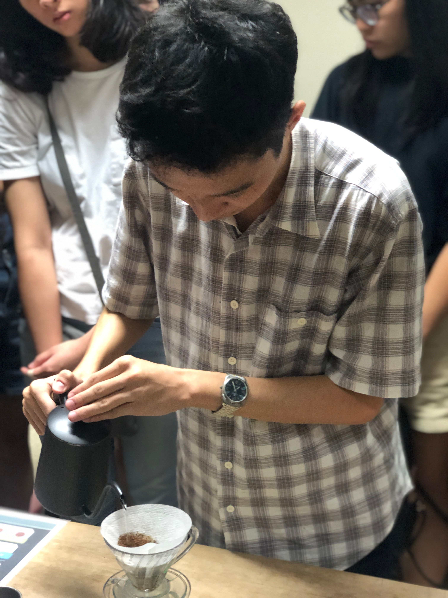
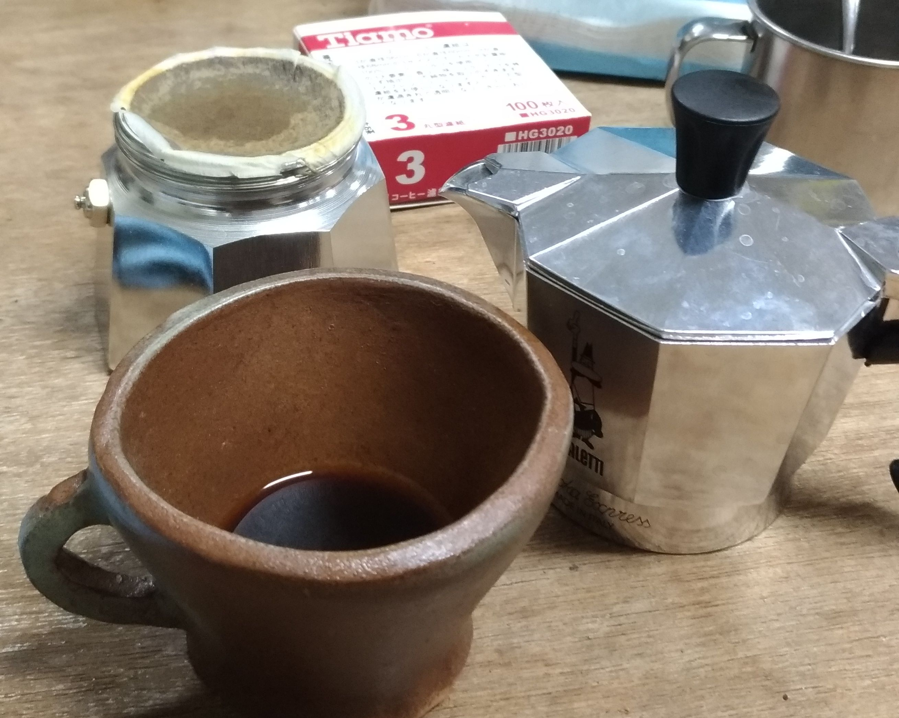

+++
title = "興趣及專長"
description = "更多關於我的興趣與專長"
date = 2021-11-21
+++

# 興趣

## 咖啡

精品咖啡可以為生活增添不少樂趣，從個人喜愛的風味、咖啡豆產地，到沖煮方式等，都是令人著迷的學問。

探索咖啡也正是我的興趣之一。

## 動漫與輕小說

看製作組如何用畫面精巧的講述一個故事，是觀看動畫的樂趣。

讀作家如何用文字扣人心弦的帶你去深入人物的心境，是閱讀輕小說的樂趣。

《86 －不存在的戰區－》
Image illistrated by しらび on [Pixiv](https://www.pixiv.net/artworks/68781704)

# 專長
- Unix 程式開發
- Linux 系統管理
- Kubernetes 管理
- CI/CD
- Rust Programming Language
- 網路管理

